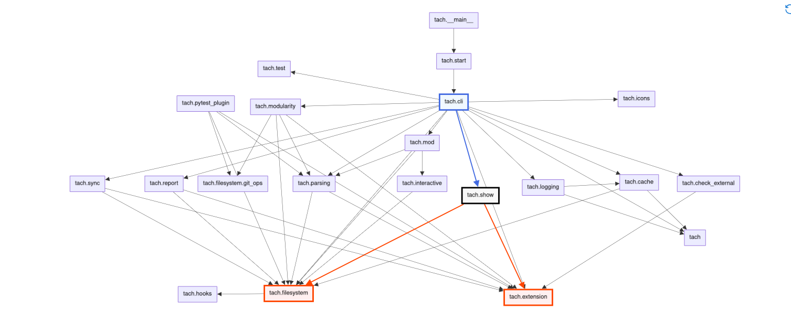

# Tach

[](https://pepy.tech/project/tach)
[](https://pypi.Python.org/pypi/tach)
[](https://pypi.Python.org/pypi/tach)
[](https://pypi.Python.org/pypi/tach)
[](https://github.com/gauge-sh/tach/actions/workflows/ci.yml)
[](https://microsoft.github.io/pyright/)
[](https://github.com/astral-sh/ruff)

Tach is a Python tool to enforce dependencies and interfaces, written in Rust. Tach is inspired by the [modular monolith](https://www.milanjovanovic.tech/blog/what-is-a-modular-monolith) architecture.

[Docs](https://docs.gauge.sh)

[Discord](https://discord.gg/Kz2TnszerR)

<div align="center">
    
</div>

Here's an example:


Tach can enforce:

- 📋 Imports only come from [declared dependencies](https://docs.gauge.sh/configuration#modules)
- 🤝 Cross-module calls use the [public interface](https://docs.gauge.sh/configuration#interfaces)
- ⛓️‍💥 [No cycles](https://docs.gauge.sh/configuration) in the dependency graph


Tach is:

- 🌎 Open source
- 🐍 Installable via pip
- 🔧 Able to be adopted incrementally
- ⚡ Implemented with no runtime impact
- ♾️ Interoperable with your existing systems

## Getting Started

### Installation

```bash
pip install tach
```

### Setup

Tach allows you to configure where you want to place module boundaries in your project.

You can do this interactively - run:

```bash
 tach mod
# Up/Down: Navigate  Enter: Mark/unmark module  Right: Expand  Left: Collapse  Ctrl + Up: Jump to parent
# Ctrl + s: Exit and save  Ctrl + c: Exit without saving  Ctrl + a: Mark/unmark all
```

Mark each module boundary with 'Enter'. You can mark all of your top-level Python source packages, or just a few which you want to isolate.

If your Python code lives below your project root, or if you are working in a monorepo with multiple Python packages, mark your Python [source roots](https://docs.gauge.sh/usage/configuration#source-roots) using the 's' key.

This will create the config file for your project, `tach.toml`.

Once you've marked all the modules you want to enforce dependencies between, run:

```bash
tach sync
```

Dependencies that exist between each module you've marked will be written to `tach.toml`.

Check out what Tach has found!

```
cat tach.toml
```

Note: Your [source roots](https://docs.gauge.sh/usage/configuration#source-roots) will implicitly be treated as module boundaries, and can show up as `<root>`.

### Enforcement

Tach comes with a cli command to enforce the boundaries that you just set up! From the root of your Python project, run:

```bash
tach check
```

You will see:

```bash
✅ All modules validated!
```

You can validate that Tach is working by either:

1. Commenting out an item in a `depends_on` key in `tach.toml`
2. By adding an import between modules that didn't previously import from each other.

Give both a try and run `tach check` again. This will generate an error:

```bash
❌ tach/check.py[L8]: Cannot import 'tach.filesystem'. Module 'tach' cannot depend on 'tach.filesystem'.
```

Each error indicates an import which violates your dependencies. If your terminal supports hyperlinks, click on the file path to go directly to the error.

When an error is detected, `tach check` will exit with a non-zero code. It can be easily integrated with CI/CD, [Pre-commit hooks](https://docs.gauge.sh/usage/commands#tach-install), and [VS Code](https://marketplace.visualstudio.com/items?itemName=Gauge.tach), and more!

### Extras

Visualize your dependency graph.

```bash
tach show [--web]
```

Tach will generate a graph of your dependencies. Here's what this looks like for Tach:



Note that this graph is generated remotely with the contents of your `tach.toml` when running `tach show --web`.

If you would like to use the [GraphViz DOT format](https://graphviz.org/about/) locally, simply running `tach show` will generate `tach_module_graph.dot` in your working directory.

You can view the dependencies and usages for a given path:

```bash
tach report my_package/
# OR
tach report my_module.py
```

e.g.:

```bash
> tach report python/tach/filesystem
[Dependencies of 'python/tach/filesystem']
python/tach/filesystem/install.py[L6]: Import 'tach.hooks.build_pre_commit_hook_content'
python/tach/filesystem/project.py[L5]: Import 'tach.constants.CONFIG_FILE_NAME'
...
-------------------------------
[Usages of 'python/tach/filesystem']
python/tach/cache/access.py[L8]: Import 'tach.filesystem.find_project_config_root'
python/tach/cache/setup.py[L7]: Import 'tach.filesystem.find_project_config_root'
...
```

Tach also supports:

- [Public interfaces for modules](https://docs.gauge.sh/usage/interfaces/)
- [Deprecating individual dependencies](https://docs.gauge.sh/usage/deprecate)
- [Incremental adoption](https://docs.gauge.sh/usage/unchecked-modules)
- [Manual file configuration](https://docs.gauge.sh/usage/configuration)
- [Monorepos and namespace packages](https://docs.gauge.sh/usage/configuration#source-roots)
- [Inline 'ignore' comments](https://docs.gauge.sh/usage/tach-ignore)
- [Pre-commit hooks](https://docs.gauge.sh/usage/commands#tach-install)

More info in the [docs](https://docs.gauge.sh/). Tach logs anonymized usage statistics which can be [opted out](https://docs.gauge.sh/usage/faq/) of.
If you have any feedback, we'd love to talk!

If you have any questions or run into any issues, let us know by either reaching out on [Discord](https://discord.gg/Kz2TnszerR) or submitting a [Github Issue](https://github.com/gauge-sh/tach/issues)!

---

### Contributors

<a href="https://github.com/gauge-sh/tach/graphs/contributors">
  
</a>
